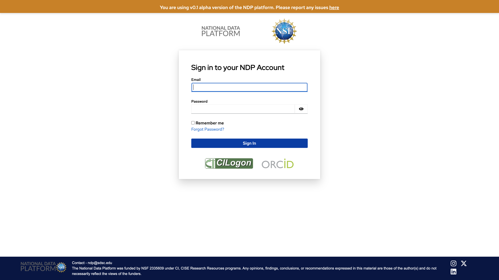
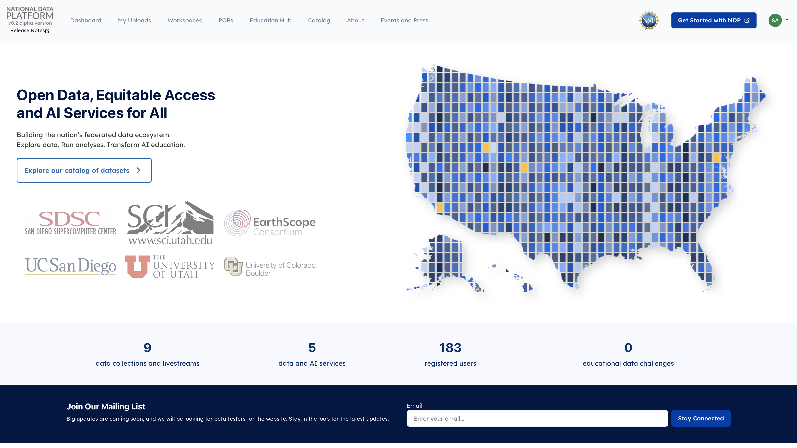
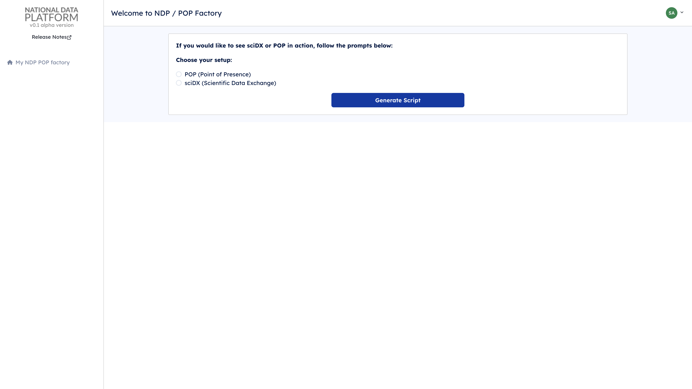
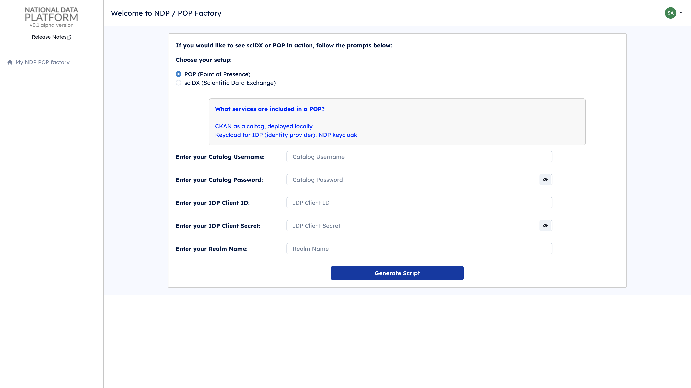
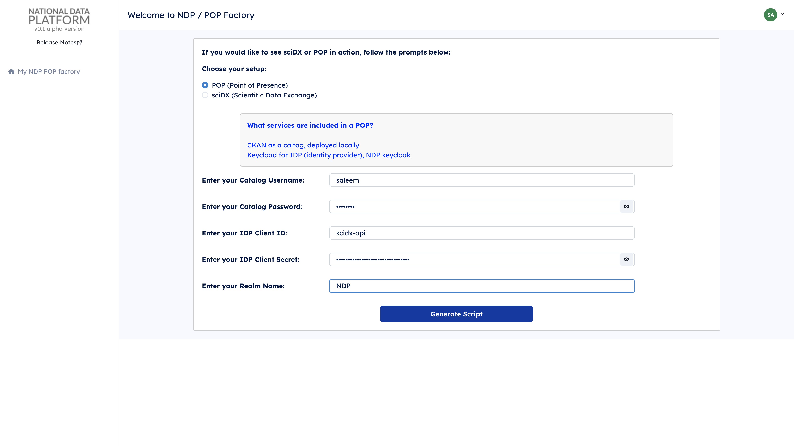
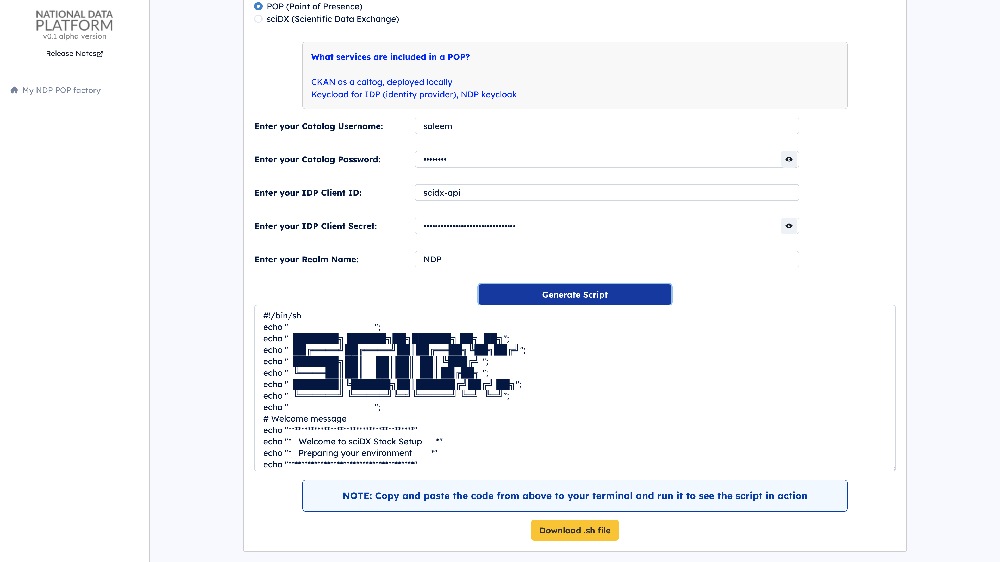

# Generating and Running a POP Setup Script

This guide will walk you through generating a setup script for your Point of Presence (POP) and running it on your infrastructure. Follow these simple steps to get everything up and running smoothly.

## Requirements for Running the Script
- **Sudo privileges**: The script assumes you have **sudo** privileges. If you are not a sudo user, you may need to manually adjust commands involving `sudo`.
- **Tools, permissions, and ports required**:
  - **Docker** (latest version) - [Install Docker](https://docs.docker.com/engine/install/)
  - **Docker Compose** (latest version) - [Install Docker Compose](https://docs.docker.com/compose/install/)
  - **Uvicorn** (latest version): Install via PIP:
    ```bash
    pip install uvicorn
    ```
  - **PIP** (latest version) - [Install PIP](https://pip.pypa.io/en/stable/cli/pip_install/)
  - **Python 3** (latest version)
  - **Git** (latest version) - [Install Git](https://git-scm.com/book/en/v2/Getting-Started-Installing-Git)
  - **Ports 8000 and 8443** should be open
  - **Write permissions** on the server file system

**Note**: This script has been tested on **Ubuntu 22.04 LTS**. If you plan to run it on other operating systems or Linux distributions, you may need to modify it accordingly.

## Step 1: Access the National Data Platform
1. Open your web browser and navigate to [nationaldataplatform.org](https://nationaldataplatform.org).

   

## Step 2: Log In
2. Click on the **Log in/Register** button to sign in with your credentials.

   

## Step 3: Navigate to POPs
3. Once logged in, locate and click on **POPs** in the sidebar or main navigation to access the NDP POP Factory.

   

## Step 4: Choose POP Setup
4. You will see an option to choose between POP (Point of Presence) or sciDX (Scientific Data Exchange). Select **POP** to proceed.

   

## Step 5: Fill in the Required Fields
5. A form will appear asking for specific details:
   - **Catalog Username**: Enter your catalog username.
   - **Catalog Password**: Enter your catalog password.
   - **IDP Client ID**: Enter the client ID for the Identity Provider. Contact the National Data Platform IDP Admins ([Andreu](https://github.com/Andreufb), [Sergey](https://github.com/sergeygurvich)) to get this information.
   - **IDP Client Secret**: Enter the client secret.
   - **Realm Name**: Enter the appropriate realm name.

   

## Step 6: Generate the Script
6. Fill in the required fields and click on the **Generate Script** button.

   

7. After a few moments, the setup script will be generated. Copy the script from the generated box or download it.

   

## Step 7: Log in to Your Server
8. Log into your server where you want to deploy the POP setup. It is recommended to have **sudo** permissions.

## Step 8: Save the Script
9. On your server, open a text editor (like `nano` or `vim`) and paste the copied script. Save the file as `setup.sh`. Alternatively, you can download the file and copy it from your local machine to the server where the POP will be deployed (e.g., using `scp` or a similar tool).

## Step 9: Run the Setup Script
10. Run the script by executing the following command:
    ```bash
    bash setup.sh
    ```
    This will initiate the setup process for your POP environment. It will take around 5-6 minutes to complete the setup and configure all the connections and permissions.

    

## Accessing the Setup
After the setup completes, you can access the catalog at `http://YourMachinePublicIP:8443` and the POP API at `http://YourMachinePublicIP:8000`.

## Important Note for Non-Sudo Users
The generated script assumes that the user has **sudo** privileges. If you do not have sudo privileges, you should comment out the parts that use `sudo`. Specifically, comment out or modify the following sections:

- Installation commands:
  ```bash
  # Install necessary tools
  install_docker
  install_docker_compose
  install_git
  install_python
  install_uvicorn
  ensure_user_permissions
  ```

By commenting out the above sections, you will prevent the script from executing any commands that require `sudo`. However, you will need to ask your system administrator to install these packages if they are not already available on your system.

## Need Help?
If you encounter any issues, please refer to the documentation provided on the platform or contact support at [saleemalharir1](https://github.com/saleemalharir1).

